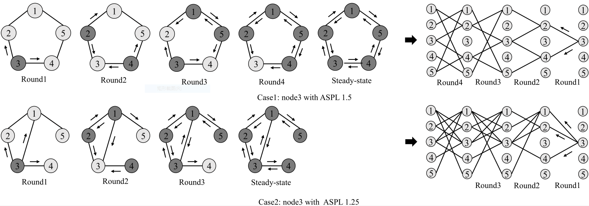
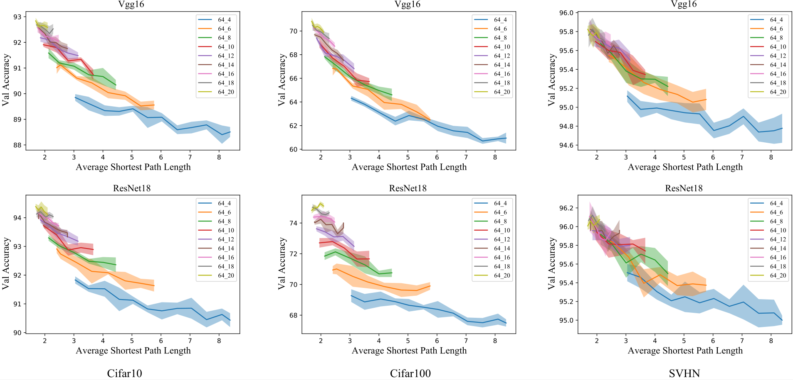

# RGP: Neural Network Pruning through Its RegularGraph Structure

This repository is the official implementation of <br/>
**《RGP: Neural Network Pruning through Its RegularGraph Structure》**


<p align="center">

</p>

## Simple Example
A simple example to illustrate information transfer in graph and gradient transfer in neural
network. We analyze node 3 and set two cases of different ASPL
<!--  -->

<p align="center">

</p>

## Analysis
The statistical relationship between ```average shortest path length (ASPL), Gradient-Resistance(GR) and average output-neuron parameters usage (AOPU)```. We calculated three values on
64-node, 4-degree regular graphs, the corresponding neural network is a 15-layer MLP, and each
layer contains 64 neurons.
<!--  -->

<p align="center">

</p>

## Setup

1. Set up a virtualenv with python 3.7.9. You can use pyvenv or conda for this.
2. Run ```pip install -r requirements.txt```to get requirements
3. Create a data directory as a base for all datasets. For example, if your base directory is ```/datadir/datasets```then imagenet would be located at ```/datadir/datasets/imagenet```and CIFAR-10 would be located at ```/datadir/datasets/cifar10```.
For imagenet, you should place train data and val data in ```/datadir/datasets/imagenet/train``` and ```/datadir/datasets/imagenet/val``` respectively.

## Training
We use config files located in the  ```configs/``` folder to organize our experiments. The basic setup for any experiment is:
To train the model(s) in the paper, run this command:

```train
python train.py --config <path_to_config> <override-args>
```
Common example ```override-args```include ```--multigpu=<gpu-ids seperated by commas, no spaces>```to run on GPUs for an experiment. Run ```python main --help```for more details.

### Example Run
1. Run Baselines Train
```python
python main.py --config configs/baselines/resnet18-dense-cifar100.yaml \
               --multigpu 0 \
               --name baselines
```
2. Run Experiments Train
```python
python main.py --config configs/baselines/resnet18-graph-cifar100.yaml \
               --multigpu 0 \
               --name 64_4 \
               --matrix Adjacency\64\4\M0.npy \
               --first-layer-dense \
               --last-layer-dense \
               --freeze-subnet \
               --set-connection
```
3. Run Baselines Evaluate
```python
python main.py --config configs/baselines/resnet18-dense-cifar100.yaml \
               --multigpu 0 \
               --pretrained <path_to_pth> \
               --evaluate
```
4. Run Experiments Evaluate
```python
python main.py --config configs/baselines/resnet18-graph-cifar100.yaml \
               --first-layer-dense \
               --last-layer-dense \
               --multigpu <id(s)_to_device> \
               --pretrained <path_to_pth> \
               --evaluate 
```
5. Run Bash
```sh
bash orders\experiment\64_4.sh <dataset> <id(s)_to_device> <arch>
```
### Tracking

```
tensorboard --logdir runs/ --bind_all
```

When your experiment is done, a CSV entry will be written (or appended) to ```runs/results.csv```. Your experiment base directory will automatically be written to ```runs/<config-name>/<experiment-name>```with ```checkpoints/```and ```logs/```subdirectories. If your experiment happens to match a previously created experiment base directory then an integer increment will be added to the filepath (eg. ```/0```, ```/1```, etc.). Checkpoints by default will have the first, best, and last models. To change this behavior, use the ```--save-every```flag. 

## Key Codes
Accord to paper **[Graph Structure of Neural Networks](https://arxiv.org/abs/2007.06559)**
```python
class GraphConv2D(nn.Conv2d):
    """GraphMap Conv2D"""

    def __init__(self, *args, **kwargs):
        super().__init__(*args, **kwargs)
        # make use min(in_channels, out_channels) <= nodes
        assert parser_args.nodes <= min(self.in_channels, self.out_channels)
        self.scores = np.random.randn(parser_args.nodes, parser_args.nodes, 1, 1)
        self.scores = self.compute_densemask(self.scores)

    def forward(self, x):
        w = self.weight * self.scores
        x = F.conv2d(
            x, w, self.bias, self.stride, self.padding, self.dilation, self.groups
        )

        return x

    def compute_densemask(self, scores):
        nodes = scores.shape[0]
        repeat_in = self.compute_size(self.in_channels, nodes)
        repeat_out = self.compute_size(self.out_channels, nodes)
        scores = np.repeat(scores, repeat_in, axis=1)
        scores = np.repeat(scores, repeat_out, axis=0)

        return nn.Parameter(torch.Tensor(scores))

    def compute_size(self, channel, nodes, seed=1):
        np.random.seed(seed)
        divide = channel // nodes
        remain = channel % nodes
        out = np.zeros(nodes, dtype=int)
        out[:remain] = divide + 1
        out[remain:] = divide
        out = np.random.permutation(out)

        return out

    def set_connection(self, scores):
        scores = scores[...,np.newaxis, np.newaxis]
        self.scores = self.compute_densemask(scores)
```


### Expected Results and Pretrained Models
Performance changes during graph structure search.Figure show the accuray of two models on three datasets changes when the average shortest path of graph changes.
<!--  -->

<p align="center">

</p>

You can download pretrained models pretrained on ImageNet here:

#### Image Classification on ImageNet
|Model name|    Top 1 Accuracy  |Top 5 Accuracy |Params Remain    | FlOPs Remain|
|---|---------------- | -------------- |  -------------- |  ----------- |
| [ResNet50 baseline](https://drive.google.com/file/d/1dw_03RKxFBJhs5pRgNWipI6NqXNJ8nIZ/view?usp=sharing)|76.22%|93.00%|100%|100%|
| [ResNet50 64_36](https://drive.google.com/file/d/1WCcKSta30CW2JDwO7M0BldO-gIKYEf82/view?usp=sharing)|75.30%|92.55%|$\approx$ 56.25%|$\approx$ 56.25%|
| [ResNet50 64_30](https://drive.google.com/file/d/1g041RIsT7QEcOGavxzEJFpZQQqZRURSS/view?usp=sharing)|74.58%|92.09%|$\approx$ 46.88%|$\approx$ 46.88%|
| [ResNet50 64_24](https://drive.google.com/file/d/1F83hsPQP9qyhq0NdLE0urSJKiGI0E7FW/view?usp=sharing)|74.07%|91.86%|$\approx$ 37.50%|$\approx$ 37.50%|
| [ResNet50 64_16](https://drive.google.com/file/d/1RCRj9uxLKpMjSTJ6Vi16cdIIrd4apZnM/view?usp=sharing)|72.68%|91.06%|$\approx$ 25.00%|$\approx$ 25.00%|

## Matrix
You can find details of adjacency matrix in the ```Adjacency/*/*/*.csv```,the informations of average shortest path, clustering coefficient and transitivity.

## License

**RPG** is released under the MIT license. Please see the [LICENSE](LICENSE) file for more information.
## Requirements

Python 3.7.9, CUDA Version 10.1,CUDNN Version 7.6.5:
```
absl-py==0.8.1
grpcio==1.24.3
Markdown==3.1.1
networkx==2.5
numpy==1.18.5
nvidia==9.0.0
nvidia-dali-cuda100==1.1.0
Pillow==6.2.1
protobuf==3.10.0
PyYAML==5.2
ruamel-yaml==0.16.3
ruamel-yaml-clib==0.2.2
tensorboard==2.5.0
torch==1.8.0
torchvision==0.9.0
tqdm==4.60.0
Werkzeug==0.16.0
...
```

To install requirements:

```setup
pip install -r requirements.txt
```